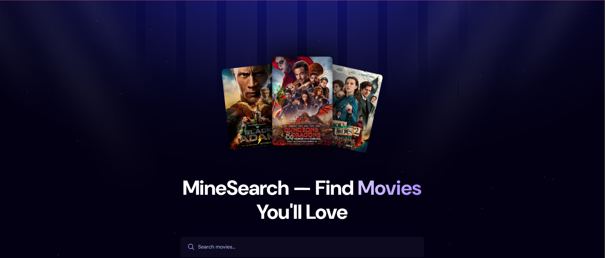
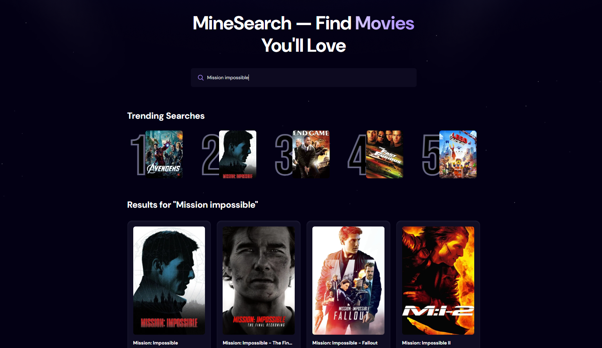

# MovieVault 🎬 — Find Movies You'll Love

A sleek, responsive movie discovery web application built with **React.js** and **Tailwind CSS**. Features real-time search with optimized debouncing and a custom trending movies tracker backend powered by **Node.js** and **Express**, using the **TMDB (The Movie Database) API**.

🔗 **Live Demo:** [movievault-mm2001994s-projects.vercel.app](https://movievault-mm2001994s-projects.vercel.app)

---

## 🚀 Features

- **Real-Time Search with Debouncing** — Instant movie lookup that minimizes API calls by waiting for the user to stop typing
- **Trending Searches Tracker** — Displays the top 5 most-searched movies, tracked by a custom Node.js/Express REST API with JSON file storage
- **Cinematic UI** — Dark-themed aesthetic built with Tailwind CSS, featuring smooth hover effects, clean typography, and high-quality TMDB movie posters
- **Fully Responsive** — Optimized layouts across desktop, tablet, and mobile

---

## 📸 Preview

### 🏠 Landing Page


### 🔍 Search Results & Trending


---

## 🛠️ Tech Stack

**Frontend:**
- React.js (Functional components, Hooks — useState, useEffect, useDebounce)
- Tailwind CSS v4
- Vite

**Backend:**
- Node.js & Express.js
- JSON file storage (lightweight trending tracker)
- TMDB API

**Deployment:**
- Frontend → Vercel
- Backend → Render

---

## ⚙️ Environment Variables

### Frontend — create `.env` in project root:
```env
VITE_TMDB_API_KEY=your_tmdb_bearer_token_here
VITE_BACKEND_URL=http://localhost:5000
```

### Backend — no `.env` needed locally (port is hardcoded to 5000)

> Never commit your `.env` file. It is already in `.gitignore`.

---

## 📦 Local Setup

1. **Clone the repo:**
```bash
git clone https://github.com/manishmondal331/movievault.git
cd movievault
```

2. **Start the backend:**
```bash
cd server
npm install
npm run dev
```
Backend runs on `http://localhost:5000`
Test it: `http://localhost:5000/health` should return `{"status":"ok"}`

3. **Start the frontend** (new terminal):
```bash
cd ..
npm install
npm run dev
```
Frontend runs on `http://localhost:5173`

---

## 📡 API Endpoints

| Method | Endpoint | Description |
|--------|----------|-------------|
| `GET` | `/health` | Server health check |
| `GET` | `/api/trending` | Get top 5 most searched movies |
| `POST` | `/api/trending` | Record a movie search |

---

## 🔐 TMDB API

This project uses the [TMDB API](https://www.themoviedb.org/documentation/api). You'll need a free API key from TMDB to run it locally.

---

## 👨‍💻 Author

**Manish Mondal** — [LinkedIn](https://linkedin.com/in/manish-mondal-32b941215) · [GitHub](https://github.com/manishmondal331)